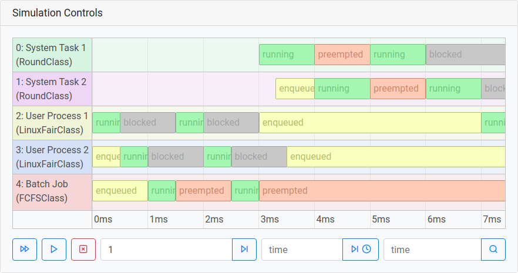
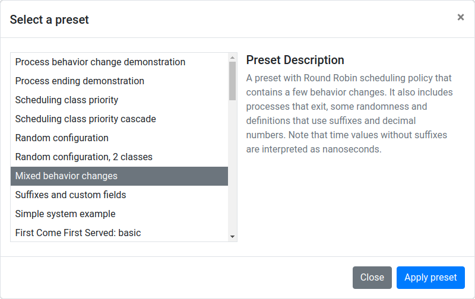
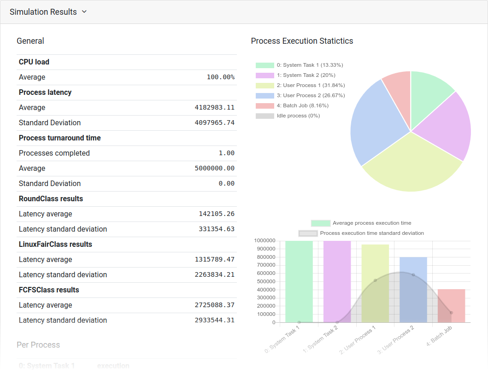

# SchedLinSim
>A process scheduling simulator based on the Linux kernel.

<br/>

SchedLinSim is a process scheduling simulator written in JavaScript. It supports a number of scheduling strategies, calculation of general and per-process scheduling statistics, precise and random process definitions and visualization of the scheduling process.

<br/>

[](https://jmakovecki.github.io/SchedLinSim/index.html)

<br/>

The simulator comes with an included graphical user interface in the form of a web application, but can also be used as a standalone library on the command line. Simulations can be run all at once, step by step, or in an animated manner. Multiple simulations can also be ran in succession, in which case the resulting statistics are calculated as averages of individual runs.

SchedLinSim is designed in a manner similar to the Linux kernel scheduler, which makes it easier to test scheduling algorithms with the intention of implementing them in the kernel. It follows the kernel's concept of *scheduling classes*, which allow multiple scheduling algorithms to be used at the same time - the processes get assigned to a class that schedules them according to its logic.

<br/>

## Running a simulation
> The main use of a simulator.

The easiest way of running a simulation is to open the [web application](https://jmakovecki.github.io/SchedLinSim/index.html) and select a simulation scenario from the included presets.

<br/>

[](https://jmakovecki.github.io/SchedLinSim/index.html)

<br/>

After a preset is selected, it is loaded into the simulator, which displays its settings and process definitions, that can be modified before the simulation is started. Simulations executed in the GUI get presented to the user in the form of a Gantt chart, illustrated above.

When the simulation is finished, the simulator will load its results into the GUI and present them in the form of tables and graphs. These will differ from what is shown below when running multiple simulations in a row.

<br/>

[](https://jmakovecki.github.io/SchedLinSim/index.html)

<br/>

### Running in the command line
> Most easily achieved by opening the browser console on either the [GUI](https://jmakovecki.github.io/SchedLinSim/index.html) or the [lightweight command line](https://jmakovecki.github.io/SchedLinSim/simulator/SchedLinSim-console.html) web page.

When running in the command line, most of the functionality of the simulator gets wrapped up in its namespace, `Simulator`. Executing a simulation in the simulator requires the following commands:
```JavaScript
Simulator.init(definition);
Simulator.run();
```
Simulation definitions are JavaScript objects that contain all the data needed to run a simulation. They can be stored as JSON files, but need to be parsed using `JSON.parse(textDefinition)` before being handed to the simulator. For a guide on writing simulation definitions, check out [simulator/docs/templates/Simulation-definition-template.js](simulator/docs/templates/Simulation-definition-template.js). A simulation definition in JSON form can also be exported from the graphical user interface.

Simulator can also be initialized with the name of a preset - for example `Simulator.init("simpleSystemConf")`. In this case the simulator will find and load the preset on its own. All the presets are contained in the object `SimulationPresets`, that is defined in the file [simulator/SimulationPresets.js](simulator/SimulationPresets.js). They can serve as good examples when writing your own simulation definition.

When the simulation is finished, a `SimResult` object is returned, which is described in detail in the [documentation (SimResult)](https://jmakovecki.github.io/SchedLinSim/simulator/docs/index.html#simresult).

### Multiple runs in the command line
The interface for running simulations in succession is contained in the object `Simulator.multiRun`. To run, say, 200 simulations in a row, execute the following commands:
```JavaScript
Simulator.multiRun.init(definition);
Simulator.multiRun.run(200);
```
The simulation definition passed to `multiRun.init()` is the same as with single simulation executions and works as described above, so `Simulator.multiRun.init("simpleSystemConf")` will load a preset. The call to the `multiRun.run()` function contains a parameter - the number of simulations that we wish to run. It returns an object with joint simulation results, which is better described in the function's [documentation (Simulator > multiRun > run())](https://jmakovecki.github.io/SchedLinSim/simulator/docs/index.html#simulatormultirun).

Individual simulation results of the last sequence of simulations ran by `multiRun` are saved in the array `Simulator.multiRun.results` where they can be viewed by the user.

<br/>

## Scheduling classes
> The policies which govern the decisions that the scheduler makes.

A scheduling class is an object that implements a scheduling policy. It contains a number of methods that the main scheduler calls to make scheduling decisions. Processes are assigned to scheduling classes, so every process has a class that is responsible for its scheduling. Multiple scheduling classes can be in use at the same time and the processes on the system are distributed amongst them.

Scheduling classes exist in a strict hierarchy, they are ordered in a line by priority and a process of a higher priority scheduling class will always run before the process of a lower priority class. Similarly, if a process of a higher priority class appears while a process of a lower priority class is running, it will be preempted and the higher priority process will run instead.

The simulator implements a number of scheduling classes and allows ordering them as desired in every simulation. Their implementations can be found in directory `simulator/classes/`.

If one wishes to add a custom scheduling policy into the simulator, one will have to implement a scheduling class of their own. This can be done by following the instructions found in the template [SchedClass-template.js](simulator/docs/templates/SchedClass-template.js). The [documentation](https://jmakovecki.github.io/SchedLinSim/simulator/docs/index.html#schedclass) on the scheduling class object, `SchedClass`, can also be of use in this endeavor.

<br/>

## Process definitions
> Specify the processes that will run in your simulation.

Process definitions are a part of the simulation definition that has to be entered in its JSON form even when using the GUI. As such, they are a bit trickier to use and we will quickly present them here. More in depth description of process definitions can be found in the [simulation definition template](simulator/docs/templates/Simulation-definition-template.js).

Process definitions are given as an array of objects, that describe individual processes. An average process definition looks something like this:
```json
[
	{
		"pname": "Process A",
		"spawn": "100us",
		"policy": "FCFSClass",

		"behavior": [
			{
				"run": "1ms",
				"block": ["2ms", "4ms"],
				"priority": 0
			},
			{
				"simExec": "5ms",
				"run": ["2ms", "3ms"]
			},
			{
				"procExec": "7ms",
				"final": true,
				"endNicely": false
			}
		]
	},
	{
		"pname": "Process B",
		"spawn": [0, "1ms"],
		"behavior": [
			{
				"run": "1ms",
				"block": "1ms",
				"priority": 0
			},
			{
				"execCnt": 3,
				"run": "10ms",
				"block": "2ms"
			}
		]
	}
]
```
This defines two processes that will run in the simulation. Each process is defined by the following fields:
- `pname` is the name given to the process. In our case, we have "Process A" and "Process B".
- `spawn` is the time at which a process will appear in the simulation. Process A will spawn at 100 microseconds, but for Process B this value is defined with an interval - it will spawn at a random time between 0 nanoseconds and 1 millisecond of the simulation.
- `policy` is the scheduling policy which will be used when working with the process. It is essentially just the name of the scheduling class that the process will belong to. Note that Process B does not have a policy field - it will be scheduled under the default scheduling class, set on the simulation level.
- `behavior` is an array of the process's "behaviors". These define how the process will behave during the simulation.

### Process behaviors
Each process needs to have at least one behavior entry in its `behavior` array, but there can be more. A behavior entry can define three different aspects of a process's behavior:
- `run` is the time for which the process will try to run before it blocks / goes to sleep. Both processes will start out by trying to run for 1 ms.
- `block` is the time for which the process will block, before waking up to run again. Process B will, at first, block for 1 ms after each run and Process A will block for a random time between 2 ms and 4ms.
- `priority` is the priority given to a process. How this is interpreted depends on the scheduling class and many don't even support priority. Leaving it as 0 is generally a safe bet.

The first behavior entry must contain all three of these fields, while subsequent ones need at least one. When a new behavior entry becomes active, it updates the process's behavior with the fields it contains and leaves the rest as they were.

Each behavior after the first one contains exactly one "condition" field - the process will switch to a new behavior when its condition is fulfilled. Note that the behavior switches are linear - the process can't switch from its 1st behavior to its 3rd one directly, it must switch to the 2nd first. Behavior switches can occur when a process is picked to run on the processor - one behavior switch per pick, at most. The supported switch condition fields are the following:

- `simExec` stands for "simulation execution", the switch will happen after the simulation has ran for at least this much time. Process A will enter its 2nd behavior after the simulation has ran for 5 ms.
- `procExec` stands for "process execution", the switch will happen after the process has ran for at least this much time. Process A will switch to its 3rd behavior after the sum of time it spent running reaches 7 ms (it also needs to have already switched to its 2nd behavior first, but in this case that's a given).
- `execCnt` stands for "execution count", the switch will happen after the process was selected to run on the processor this many times. Process B will switch to its 2nd behavior after it's ran 3 times.

One might notice that the 3rd behavior entry of Process A is different from the others. This is a "final entry" that ends the execution of a process (makes it exit). It works the same as other behavior entries, except that it contains no behavior update fields (`run`, `block`, `priority`). Instead, it contains 2 fields:

- `final` is a boolean that needs to be set to `true` to make the behavior end the process.
- `endNicely` is a boolean that tells the simulator whether it should wait for the process to block on its own before ending it. When set to false, the process will end as soon as the behavior switch condition is fulfilled. Process A will exit after it has executed exactly for 7 ms, regardless of whether it was about to block or not.

Most of the time values (and even some others) in process definitions can be defined as either precise values or intervals. Refer to [simulation definition template](simulator/docs/templates/Simulation-definition-template.js) for specifics. The time values can be defined with time suffixes (ns, us, ms, etc) and will default to nanoseconds when numbers without suffixes are used.

<br/>

## Documentation

> SchedLinSim includes a number of resources that help with its usage and development.

- [Documentation](https://jmakovecki.github.io/SchedLinSim/simulator/docs/index.html) of the core parts of SchedLinSim is aimed both at developers and end users running the simulator from the command line. It is written using JSDoc notation and compiled with the help of [Documentation.js](https://documentation.js.org/).

- [Simulation-definition-template.js](simulator/docs/templates/Simulation-definition-template.js) is a template document with comments and explanations that serves as a guide to writing simulation definitions.

- [SchedClass-template.js](simulator/docs/templates/SchedClass-template.js) is a template  document with comments and explanations that serves as a guide to writing scheduling classes for the simulator.

<br/>

## Project organization
SchedLinSim is organized into the following directories:

- **root directory** contains the GUI, its related directories and project presentation files.
	- **simulator** contains the SchedLinSim.js main file that can be used as a library, related files and presets.
		- **classes** contains the files that implement simulator's scheduling classes.
		- **docs** contains the simulator documentation.
			- **templates** contains templates for simulation definitions and scheduling classes.

The project repository is published at: [https://github.com/jmakovecki/SchedLinSim](https://github.com/jmakovecki/SchedLinSim)
<br/>

## Credits and licence

SchedLinSim scheduling simulator was developed by Jan Makovecki, under the mentorship of doc. dr. Tomaž Dobravec and doc. dr. Jure Žabkar.

SchedLinSim is licensed under the GPL 3 licence, refer to [credits.txt](credits.txt) for specifics.

SchedLinSim contains components from other projects, refer to [credits.txt](credits.txt) for specifics and their licenses.
